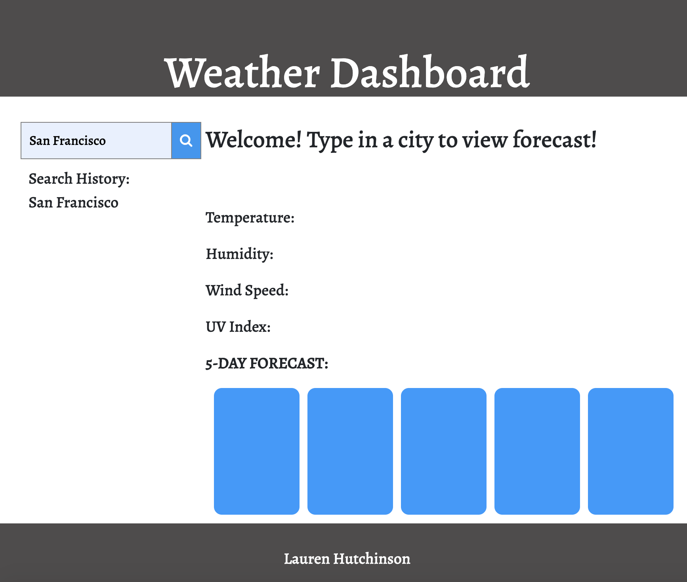

# WeatherDashboard

This weather dashboard was created using Javascript/JQuery to pull data from the open weather map API and display the current forecast, in addition to the 5-day forecast based on the city input search. As the searches are submitted, they are appended to 'search history' and stored in local storage. By navigating through the data object received from the API call, the information desired by the user is dynamically updated to the external HTML and styled by linked CSS.

